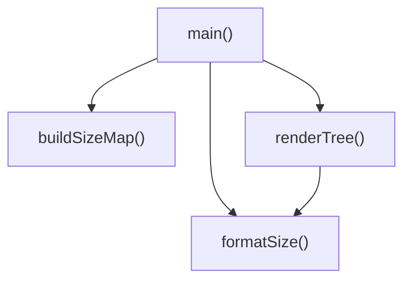

# [JavaScript]index.js 仕様書

`index.js` における主要な変数および関数の定義と、それらの依存関係を示します。

## 変数・関数定義

### 関数 `formatSize` (L11-18)
- **役割**: バイト数を人間が読みやすい単位（B, KB, MB, GB, TB）に変換する。
- **引数**:
  - `bytes` (number): 変換対象のバイト数。
- **戻り値**:
  - `string`: フォーマットされたサイズ表記（例: `"1.25 MB (1,310,720 bytes)"`）。

### 関数`buildSizeMap` (L27-64)
- **役割**: 指定されたディレクトリ配下の全ファイルおよびフォルダのサイズを1回の走査で集計し、各パスの合計バイト数を記録した `Map` オブジェクトを構築して返す。無視リストに含まれる名前のファイルやフォルダは走査から除外する。
- **引数**:
  - `dirPath` (string): 走査を開始するルートディレクトリのパス。
  - `ignoreList` (string[]): 無視するフォルダ名・ファイル名の配列。
- **戻り値**:
  - `Map<string, number>`: キーが各フォルダ・ファイルの絶対パス、値がその合計バイト数（フォルダの場合は配下のファイルサイズの合計）である `Map` オブジェクト。

### 関数`renderTree` (L72-140)
- **役割**: `buildSizeMap` で構築したサイズキャッシュ（`Map`）を利用し、指定されたディレクトリ配下のファイルとフォルダをツリー構造で再帰的にコンソールに描画する。深さ制限やサイズ順ソートのオプションに対応する。
- **引数**:
  - `dirPath` (string): 対象ディレクトリのパス。
  - `sizeMap` (Map<string, number>): `buildSizeMap` で取得したサイズ情報のマップ。
  - `options` (object):
    - `prefix` (string): 描画用インデントプレフィックス。再帰呼び出しで使用（デフォルト: `""`）。
    - `currentDepth` (number): 現在のツリーの深さ（デフォルト: `0`）。
    - `maxDepth` (number): ツリー表示の最大深さ（デフォルト: `Infinity`）。
    - `ignoreList` (string[]): 無視する名前の配列。
    - `isSort` (boolean): サイズ順（降順）でソートして描画するかどうか。
- **戻り値**:
  - `void`

### 関数`main` (L145-229)
- **役割**: コマンドのメインエントリーポイント。引数をパースして `-tree`, `-depth`, `-sort`, `-ignore` などのオプションを抽出し、対象パスに対して `buildSizeMap` を呼び出した後、サイズ表示やツリー描画を行う。
- **引数**:
  - なし（`process.argv` から取得）。
- **戻り値**:
  - `void`

---

## 依存関係マッピング (Dependency Mapping)

---

## 影響範囲 (Impact Scope)

- **既存コードへの影響**:
  - `getDirSize` を廃止し、`buildSizeMap` に統合します。
- **外部環境への影響**:
  - 新しいコマンドラインオプションが追加されるため、引数パースの仕様が拡張されます。