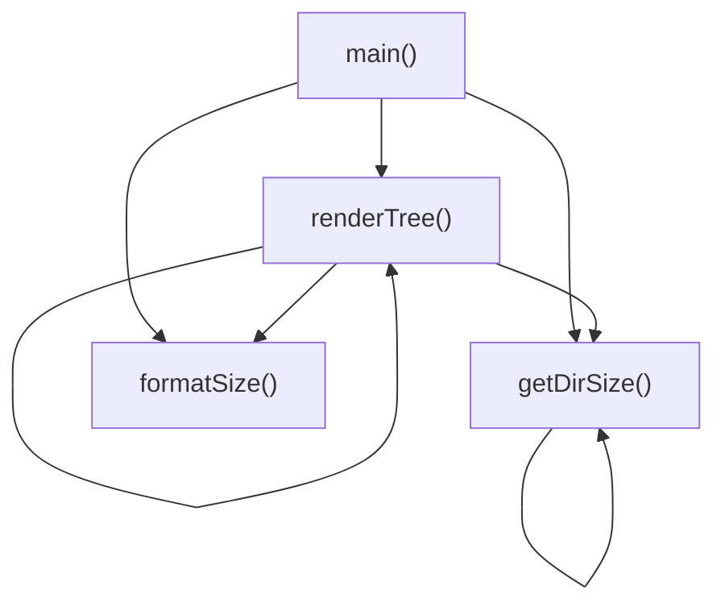

# [JavaScript]index.js 仕様書

`index.js` における主要な変数および関数の定義と、それらの依存関係を示します。

## 変数・関数定義

### `formatSize` (関数)
- **役割**: バイト数を人間が読みやすい単位（B, KB, MB, GB, TB）に変換する。
- **引数**:
  - `bytes` (number): 変換対象のバイト数。
- **戻り値**:
  - `string`: フォーマットされたサイズ表記（例: `"1.25 MB (1,310,720 bytes)"`）。

### `getDirSize` (関数)
- **役割**: 指定されたディレクトリ配下の全ファイルの合計サイズを再帰的に計算する。
- **引数**:
  - `dirPath` (string): 対象ディレクトリのパス。
- **戻り値**:
  - `number`: ディレクトリ配下の全ファイルの合計バイト数。

### `renderTree` (関数)
- **役割**: 指定されたディレクトリ配下のファイルとフォルダをツリー構造で再帰的にコンソールに描画し、それぞれのサイズを出力する。
- **引数**:
  - `dirPath` (string): 対象ディレクトリのパス。
  - `prefix` (string): 描画用インデントプレフィックス。再帰呼び出しで使用（デフォルト: `""`）。
- **戻り値**:
  - `void`

### `main` (関数)
- **役割**: コマンドのメインエントリーポイント。引数をパースし、`-tree` オプションの有無や対象パスを判別して適切な処理（サイズ計算またはツリー描画）を呼び出す。
- **引数**:
  - なし（`process.argv` から取得）。
- **戻り値**:
  - `void`

---

## 依存関係マッピング (Dependency Mapping)

---

## 影響範囲 (Impact Scope)

- **既存コードへの影響**:
  - 新規プロジェクトのため、既存コードへの機能的な影響はありません。
- **外部環境への影響**:
  - `npm link` によりグローバルに `yoryo` コマンドがバインドされます。他の同名コマンドとの競合に注意する必要があります。
