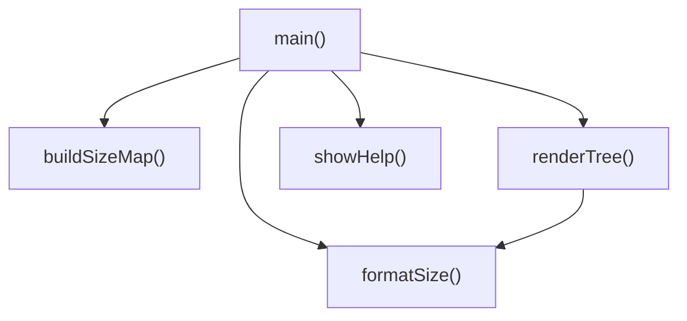

# [JavaScript]index.js 仕様書

`index.js` における主要な定数、変数および関数の定義と、それらの依存関係を示します。

## 関数定義

### 関数 `showHelp` (L40-61)
- **役割**: ツールの使い方と利用可能なオプション一覧（ヘルプメッセージ）を英語でコンソールに出力する。
- **引数**: なし
- **戻り値**:
  - `void`

### 関数 `formatSize` (L69-82)
- **役割**: バイト数を人間が読みやすい単位（B, KB, MB, GB, TB）に変換する。カラー表示が有効な場合はサイズ情報を灰色で装飾する。
- **引数**:
  - `bytes` (number): 変換対象のバイト数。
  - `useColor` (boolean): カラー表示を使用するかどうか（デフォルト: `false`）。
- **戻り値**:
  - `string`: フォーマットされたサイズ表記。

### 関数 `buildSizeMap` (L91-145)
- **役割**: 指定されたディレクトリ配下の全ファイルおよびフォルダのサイズを1回の走査で集計し、各パスの合計バイト数を記録した `Map` オブジェクトを構築して返す。無視リストに含まれるフォルダ、およびパターンマッチでマッチしなかったファイルは除外し、マッチしたファイルが配下に存在しないフォルダも除外する。
- **引数**:
  - `dirPath` (string): 走査を開始するルートディレクトリのパス。
  - `options` (object):
    - `ignoreList` (string[]): 無視するフォルダ名・ファイル名の配列。
    - `matchPattern` (string): ワイルドカードの検索・マッチングパターン。
  - `sizeMap` (Map<string, number>): 再帰用サイズ情報マップ（内部処理で使用）。
- **戻り値**:
  - `Map<string, number>`: キーが各フォルダ・ファイルの絶対パス、値がその合計バイト数である `Map` オブジェクト。

### 関数 `renderTree` (L153-250)
- **役割**: `buildSizeMap` で構築したサイズキャッシュ（`Map`）を利用し、指定されたディレクトリ配下のファイルとフォルダをツリー構造で再帰的にコンソールに描画する。深さに応じた色分けや、サイズ順ソート、ファイル非表示（フォルダのみ）のオプションに対応する。
- **引数**:
  - `dirPath` (string): 対象ディレクトリのパス。
  - `sizeMap` (Map<string, number>): `buildSizeMap` で取得したサイズ情報のマップ。
  - `options` (object):
    - `prefix` (string): 描画用インデントプレフィックス。
    - `currentDepth` (number): 現在のツリーの深さ。
    - `maxDepth` (number): ツリー表示の最大深さ。
    - `ignoreList` (string[]): 無視する名前の配列。
    - `isSort` (boolean): サイズ順でソートして描画するかどうか。
    - `useColor` (boolean): カラー表示を使用するかどうか。
    - `showFiles` (boolean): ファイルを描画対象に含めるかどうか。
- **戻り値**:
  - `void`

### 関数 `main` (L255-384)
- **役割**: コマンドのメインエントリーポイント。引数をパースしてオプションを抽出し、`-h` または `--help` を検知した場合は `showHelp()` を実行して即座に終了する。その他の場合は `buildSizeMap` や `renderTree` を呼び出す。
- **引数**:
  - なし（`process.argv` から取得）。
- **戻り値**:
  - `void`

---

## 依存関係マッピング (Dependency Mapping)

---

## 影響範囲 (Impact Scope)

- **既存コードへの影響**:
  - `main` のパース時の一番最初で、ヘルプフラグがある場合に実行を中断してヘルプ画面を出力するようになります。
- **外部環境への影響**:
  - 利用者が `-h` または `--help` を使用可能になります。